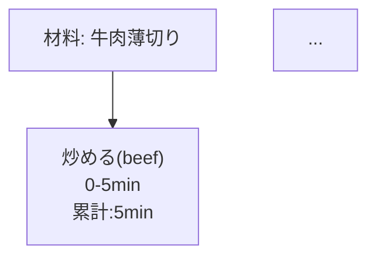

# @recipetools/core

型安全・構造化されたレシピデータを扱うための TypeScript ライブラリです。
レシピのパース、バリデーション、プロセス図生成、レシピ間の距離計算ができます。

---

## ✨ 特徴

- ✅ JSONベースのレシピデータを型安全に管理
- ✅ Mermaid記法で調理工程を可視化
- ✅ 材料・アクション単位でレシピ間の距離を計算
- ✅ 完全TypeScript対応
- ✅ OSSライセンス (MIT)

---

## 📦 インストール

```bash
npm install @recipetools/core
# or
pnpm add @recipetools/core
```

---

## 📖 使い方

1. レシピデータをパースする

```typescript
import { parseRecipe } from "@recipetools/core";
import recipeData from "./myRecipe.json";

const recipe = parseRecipe(recipeData);
```

2. レシピデータをバリデーションする

```typescript
import { validateRecipe } from "@recipetools/core";

if (!validateRecipe(recipeData)) {
  throw new Error("Invalid Recipe Format");
}
```

3. プロセス図を生成する（Mermaid記法）

```typescript
import { generateProcessGraph } from "@recipetools/core";

const mermaidGraph = generateProcessGraph(recipe);
console.log(mermaidGraph);
```

出力例:



4. レシピ同士の距離を計算する

```typescript
import { calculateIngredientDistance, calculateActionDistance } from "@recipetools/core";

const ingredientDistance = calculateIngredientDistance(recipe1, recipe2);
const actionDistance = calculateActionDistance(recipe1, recipe2);

console.log({ ingredientDistance, actionDistance });
```

---

## 🛠 提供される主なAPI

| 関数名 | 説明 |
| -- | -- |
| parseRecipe(data) | 任意データを型安全なRecipeオブジェクトに変換 |
| validateRecipe(data) | レシピデータが正しいか検証 |
| generateProcessGraph(recipe) | プロセス図（Mermaid記法）を生成 |
| calculateIngredientDistance(recipe1, recipe2) | 材料ベースのレシピ間距離を計算 |
| calculateActionDistance(recipe1, recipe2) | アクションベースのレシピ間距離を計算 |

---

## 📚 レシピデータ構造

主要な型定義例（Recipe型）:

```typescript
export interface Recipe {
  title: string;
  ingredients: Ingredient[];
  steps: Step[];
  // オプションでdescription, metadata, yield, nutrition, tools, notesなど
}
```

---

## 📝 ライセンス

MIT License
